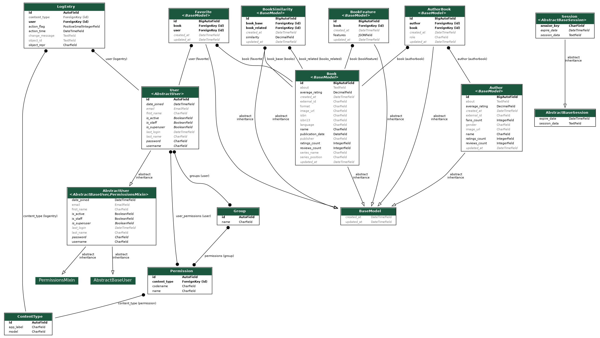

## 📋 Summary

- [📋 Summary](#-sumário)

- [🔎 About](#-about)

- [🛠 Technologies used](#-technologies-used)

- [⚙ Running project](#-running)

- [🛠 Running Tests](#-tests)

- [📚 Documentatation](#-documentation)


## 🔎 About

This projects implements Django RESTful API to manage books and authors, including user authentication, search functionality, and recommendation system..

## 🛠 Technologies used

For the development of this project, the following technologies were used:

- python 3.12.6
- Django - WebFramework
- Unittest - Python test module
- Docker and docker-compose - containers orchestration
- Postgres - Relational database
- Celery - Distributed system to process async tasks based on Queues 
- Redis - Memory database used in this project to serve queues
- Pandas - Open source Python data analysis and manipulation tool
- Numpy - Open source  Python library used for working with arrays.
- Scipy - Open source Python library used for math algorithms
- Scikit-Learn - Open source Python library used for ML algorithms


## ⚙ Running Project
To Run this project you need the docker engine and docker compose installed in your computer. To run follow next steps:


- Clone the repo:

```sh
$ git clone git@github.com:jonnison/spotter-ai.git
```

- Enter the folder:

```sh
$ cd spotter-ai/
```

- Create a `.env` with variables values based on example file `env.example`

- Build and run docker application

``` bash
$ docker-compose build
```

``` bash
$ docker-compose up -d
```

Executing Migrations

``` bash
$ docker-compose exec web python manage.py migrate
```

- View applications logs
``` bash
$ docker-compose logs -f
```


## 🛠 Running tests
To run tests, build and run application, as in the previous step and run the command:

``` bash
$ docker-compose exec web python manage.py migrate
```

## 📚 Documentation
To generate swagger json, you need only acess the following endpoint

```sh
$ curl http://localhost:8000/api/v1/schema
```

ER Diagram Used:
